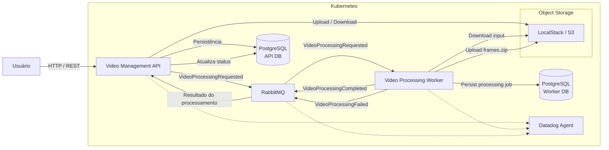

# FIAP X — Infrastructure & Kubernetes

Repositório responsável pela infraestrutura compartilhada do projeto FIAP X Video Processing.

Este repositório concentra os recursos necessários para executar a solução localmente em Kubernetes, incluindo bancos de dados PostgreSQL, RabbitMQ, LocalStack/S3 e Datadog Agent.

A infraestrutura é separada dos repositórios das aplicações (`video-management-api` e `video-processing-worker`).

---

## 1. Arquitetura geral

A solução é composta por dois serviços de aplicação independentes:

- **Video Management API** — autenticação, upload, consulta de vídeos e disponibilização do resultado.
- **Video Processing Worker** — processamento assíncrono dos vídeos utilizando FFmpeg.

A comunicação entre os serviços de aplicação ocorre exclusivamente por **RabbitMQ**.

Os arquivos de vídeo não trafegam entre API e Worker. O arquivo original é armazenado em um storage S3-compatible e o Worker recebe apenas a referência ao objeto.



### Princípios da arquitetura

1. **Processamento assíncrono**  
   A API não executa o processamento do vídeo diretamente.

2. **Desacoplamento entre serviços**  
   API e Worker possuem bancos de dados independentes.

3. **Comunicação por eventos**  
   API e Worker trocam mensagens por RabbitMQ.

4. **Object storage compartilhado**  
   O vídeo original e o ZIP de frames ficam no storage S3-compatible.

5. **Escalabilidade horizontal**  
   O Worker pode possuir múltiplas réplicas para processar vídeos simultaneamente.

6. **Persistência independente**  
   Cada aplicação é responsável pelos próprios dados.

---

## 2. Componentes de infraestrutura

| Componente | Função |
|---|---|
| Kubernetes | Orquestração dos containers |
| PostgreSQL — API | Persistência dos usuários e vídeos |
| PostgreSQL — Worker | Persistência dos jobs de processamento |
| RabbitMQ | Fila e comunicação assíncrona |
| LocalStack | Emulação local da API S3 |
| Datadog Agent | Observabilidade, logs e métricas |

### Kubernetes

O ambiente utilizado durante o desenvolvimento é o Kubernetes disponibilizado pelo Docker Desktop.

Os recursos de infraestrutura compartilhada são instalados no namespace:

```text
video-infra
```

As aplicações são implantadas no namespace:

```text
default
```

---

## 3. Bancos de dados

A arquitetura utiliza dois bancos PostgreSQL independentes.

### API Database

Responsável pelos dados pertencentes ao domínio da API:

```text
video-api-db.video-infra.svc.cluster.local:5432
```

Banco:

```text
video_management
```

Responsabilidades:

- usuários;
- vídeos;
- status apresentado ao usuário;
- informações do resultado disponível.

### Worker Database

Responsável exclusivamente pelos dados de processamento:

```text
video-worker-db.video-infra.svc.cluster.local:5432
```

Banco:

```text
video_processing
```

Responsabilidades:

- processing jobs;
- status do processamento;
- número de frames;
- mensagens de erro;
- referência ao objeto de saída.

### Regra de isolamento

O Worker **não acessa o banco da API**.

A API **não acessa o banco do Worker**.

A atualização de informações entre os serviços acontece através de mensagens RabbitMQ.

---

## 4. RabbitMQ

O RabbitMQ é utilizado como mecanismo de comunicação assíncrona entre API e Worker.

Endpoint interno:

```text
rabbitmq.video-infra.svc.cluster.local:5672
```

### Filas

```text
video-processing
video-processing-completed
video-processing-failed
```

### API → Worker

A API publica:

```text
VideoProcessingRequested
```

Exemplo conceitual:

```json
{
  "event_type": "VideoProcessingRequested",
  "video_id": "uuid",
  "user_id": "uuid",
  "input_object_key": "videos/{video_id}/input/{filename}"
}
```

### Worker → API — sucesso

```text
VideoProcessingCompleted
```

```json
{
  "event_type": "VideoProcessingCompleted",
  "video_id": "uuid",
  "user_id": "uuid",
  "output_object_key": "videos/{video_id}/output/frames.zip",
  "frame_count": 150
}
```

### Worker → API — falha

```text
VideoProcessingFailed
```

```json
{
  "event_type": "VideoProcessingFailed",
  "video_id": "uuid",
  "user_id": "uuid",
  "error_message": "..."
}
```

---

## 5. Object Storage

Durante o desenvolvimento local é utilizado o **LocalStack** para disponibilizar uma API compatível com S3.

Endpoint interno:

```text
http://localstack.video-infra.svc.cluster.local:4566
```

Bucket:

```text
videos
```

### Estrutura dos objetos

Vídeo original:

```text
videos/{video_id}/input/{filename}
```

Resultado:

```text
videos/{video_id}/output/frames.zip
```

### Fluxo

```text
API
 │
 ├── upload original
 │
 ▼
S3 / LocalStack
 │
 │ input_object_key
 ▼
RabbitMQ
 │
 ▼
Worker
 │
 ├── download original
 ├── FFmpeg
 ├── geração dos frames
 ├── criação do ZIP
 └── upload do resultado
       │
       ▼
S3 / LocalStack
```

Em um ambiente AWS, o LocalStack pode ser substituído pelo Amazon S3 sem alterar o contrato de armazenamento utilizado pelas aplicações.

---

## 6. Escalabilidade

A arquitetura permite escalar horizontalmente os componentes de aplicação.

O Worker possui HPA configurado para escalar conforme utilização de recursos.

Configuração utilizada:

```text
minReplicas: 1
maxReplicas: 10
CPU target: 70%
Memory target: 50%
```

O Worker utiliza `prefetch_count=1` no RabbitMQ, permitindo que cada consumidor mantenha uma quantidade limitada de mensagens em processamento simultâneo.

Quando a demanda aumenta:

```text
RabbitMQ
    │
    │ mensagens pendentes
    ▼
Worker replicas
    ├── Worker 1
    ├── Worker 2
    ├── Worker 3
    └── Worker N
```

Isso permite que múltiplos vídeos sejam processados simultaneamente sem que a API precise executar FFmpeg.

A fila funciona como mecanismo de desacoplamento entre a velocidade de recebimento das requisições e a capacidade momentânea de processamento.

---

## 7. Alta demanda e preservação das mensagens

As solicitações de processamento são persistidas no RabbitMQ antes de serem consumidas pelo Worker.

O processamento utiliza mensagens com `auto_ack=False`.

Dessa forma, a confirmação da mensagem não é feita simplesmente no momento do consumo.

O desenho permite que mensagens permaneçam na fila enquanto não houver capacidade suficiente de processamento.

O HPA pode aumentar o número de réplicas do Worker conforme a demanda.

Esse mecanismo é utilizado para atender ao requisito de suportar picos sem perder solicitações.

---

## 8. Observabilidade

O projeto utiliza Datadog para observabilidade.

O Datadog Agent é executado dentro do cluster Kubernetes.

São coletados dados dos serviços, incluindo:

- logs;
- métricas;
- traces/APM.

A instrumentação permite observar operações relacionadas a:

- PostgreSQL;
- S3;
- execução dos serviços;
- processamento de requisições.

O namespace utilizado para o Datadog é:

```text
datadog
```

A API Key do Datadog não é versionada.

Ela é carregada através do `.env` local e utilizada para criar o Secret do Kubernetes.

---

## 9. Estrutura do repositório

```text
video-infra-k8s/
├── .env
├── .gitignore
├── deploy.sh
└── k8s/
    ├── namespace.yaml
    ├── datadog-namespace.yaml
    ├── datadog-agent.yaml
    ├── localstack.yaml
    ├── rabbitmq.yaml
    ├── video-api-db.yaml
    └── video-worker-db.yaml
```

### `deploy.sh`

Responsável por aplicar os recursos de infraestrutura e criar os Secrets necessários a partir das variáveis locais.

Informações sensíveis não devem ser versionadas.

---

## 10. Variáveis sensíveis

O arquivo:

```text
.env
```

deve permanecer fora do Git.

Exemplo:

```env
DD_API_KEY=<datadog-api-key>
```

O `.gitignore` deve incluir:

```text
.env
```

Secrets de aplicação também não devem conter credenciais reais versionadas no repositório.

---

## 11. Deploy

Pré-requisitos:

- Docker Desktop;
- Kubernetes habilitado;
- `kubectl`;
- Docker funcionando.

Verifique o cluster:

```bash
kubectl get nodes
```

Aplicar a infraestrutura:

```bash
./deploy.sh
```

Verificar os recursos:

```bash
kubectl get pods -n video-infra
```

Verificar serviços:

```bash
kubectl get svc -n video-infra
```

---

## 12. Acessos locais

### RabbitMQ Management UI

```bash
kubectl port-forward -n video-infra svc/rabbitmq 15672:15672
```

A interface estará disponível localmente na porta:

```text
15672
```

### LocalStack

```bash
kubectl port-forward -n video-infra svc/localstack 4566:4566
```

Endpoint local:

```text
http://localhost:4566
```

### API

A API possui seu próprio Service no namespace `default`.

Exemplo:

```bash
kubectl port-forward -n default svc/video-management-api 8000:80
```

Endpoint:

```text
http://localhost:8000
```

---

## 13. Health check da infraestrutura

Verificar todos os pods:

```bash
kubectl get pods -n video-infra
```

Verificar RabbitMQ:

```bash
kubectl get pod -n video-infra -l app=rabbitmq
```

Verificar LocalStack:

```bash
kubectl get pod -n video-infra -l app=localstack
```

Verificar bancos:

```bash
kubectl get pods -n video-infra | grep db
```

---

## 14. Relação com os repositórios de aplicação

A infraestrutura é consumida pelos dois repositórios de aplicação:

```text
video-infra-k8s
       │
       ├──────────────► video-management-api
       │
       └──────────────► video-processing-worker
```

A infraestrutura não contém código de negócio.

### `video-management-api`

Responsável por:

- autenticação;
- usuários;
- upload;
- consulta de vídeos;
- status;
- download;
- publicação dos eventos de processamento;
- consumo dos eventos de resultado.

### `video-processing-worker`

Responsável por:

- consumo das mensagens;
- download do vídeo;
- processamento com FFmpeg;
- geração dos frames;
- criação do ZIP;
- upload do resultado;
- persistência do processamento;
- publicação do resultado.

---

## 15. Fluxo completo

```text
1. Usuário
      │
      ▼
2. Video Management API
      │
      ├── salva vídeo no S3
      │
      ├── salva metadata no PostgreSQL
      │
      └── publica VideoProcessingRequested
                  │
                  ▼
3. RabbitMQ
                  │
                  ▼
4. Video Processing Worker
      │
      ├── cria processing job
      ├── baixa vídeo do S3
      ├── executa FFmpeg
      ├── gera frames
      ├── cria frames.zip
      ├── envia ZIP para S3
      └── publica resultado
                  │
          ┌───────┴────────┐
          ▼                ▼
5a. Completed        5b. Failed
          │                │
          └───────┬────────┘
                  ▼
6. RabbitMQ
                  │
                  ▼
7. Video Management API
                  │
                  └── atualiza status no PostgreSQL
                              │
                              ▼
8. Usuário consulta status/download
```

---

## 16. Testes de escalabilidade

A solução foi validada com múltiplos uploads simultâneos.

Durante o teste de carga, o Worker foi observado escalando horizontalmente através do HPA.

Exemplo observado:

```text
Worker replicas:
1 → 4
```

O teste também verificou que os vídeos submetidos foram processados e concluídos.

Os testes de carga e os testes unitários das aplicações ficam documentados nos respectivos repositórios de aplicação.

---

## 17. Limitações do ambiente local

O ambiente de infraestrutura deste repositório é destinado ao desenvolvimento e demonstração local.

O LocalStack fornece uma implementação local das APIs AWS, mas não representa uma arquitetura distribuída de object storage equivalente a um ambiente de produção.

Para produção, o componente de armazenamento pode ser substituído por Amazon S3.

O Kubernetes utilizado no desenvolvimento também é o cluster local do Docker Desktop.

---

## 18. Requisitos atendidos pela infraestrutura

| Requisito | Implementação |
|---|---|
| Persistência | PostgreSQL |
| Processamento assíncrono | RabbitMQ |
| Processamento simultâneo | Múltiplas réplicas do Worker |
| Escalabilidade | Kubernetes + HPA |
| Armazenamento de vídeos | S3-compatible / LocalStack |
| Observabilidade | Datadog |
| Isolamento de dados | PostgreSQL independente por serviço |
| Comunicação entre aplicações | RabbitMQ |
| Infraestrutura versionada | Kubernetes manifests + script de deploy |
